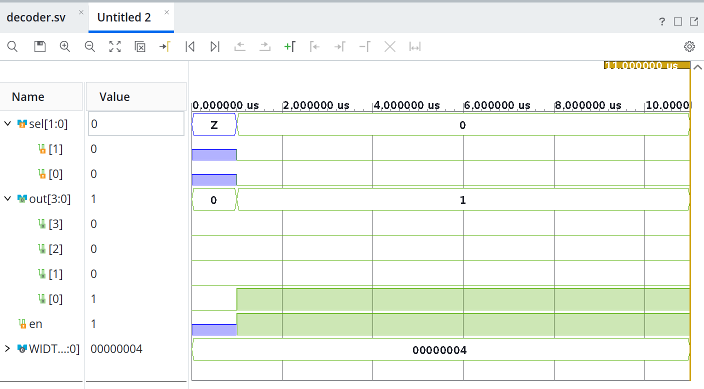
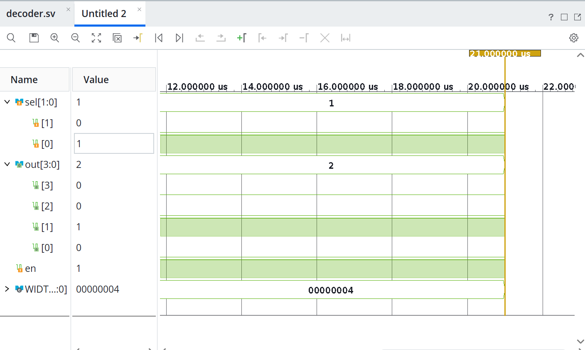
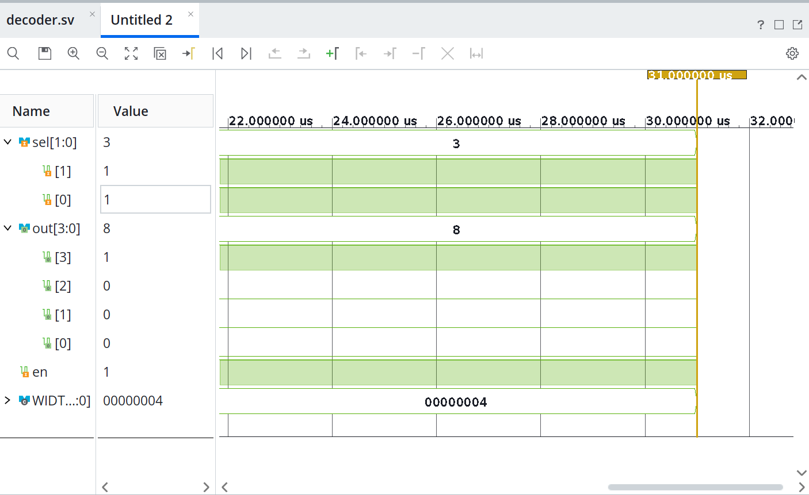
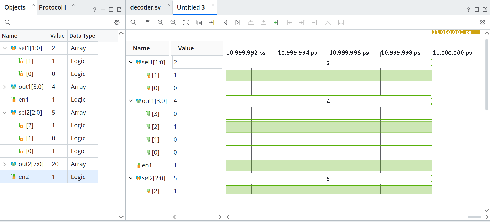
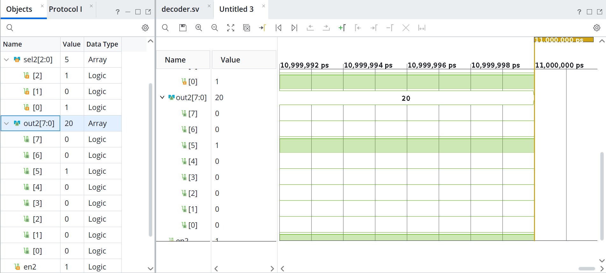
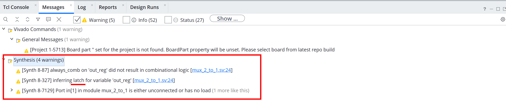
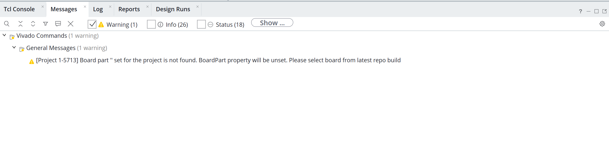
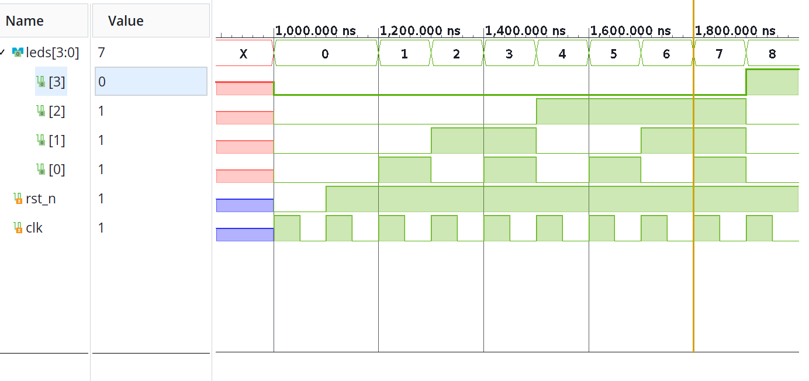

# Lesson 4 — Homework Report

## 1. Parameterized Decoder

The source files for this task are located [here](./decoder/decoder.srcs/sources_1/new).

### 1.1 Decoder Implementation

The following parameterized decoder was implemented:

```systemverilog

module decoder #(parameter WIDTH = 4) (
    input   logic   [$clog2(WIDTH)-1:0] sel,
    output  logic   [WIDTH-1:0]         out,
    input   logic                       en 
    );

    always_comb begin 
        out = 1'b0;
        if (en)
            out = (1'b1 << sel); 
    end

endmodule
```

The output is cleared when `en = 0`.

When `en = 1`, a logical `1` is shifted left by the value of `sel`:

```systemverilog
out = (1'b1 << sel);
```

For `WIDTH = 4`, the expected decoder behavior is:

| `en` | `sel` | `out` |
|:---:|:---:|:---:|
| 0 | X | `0000` |
| 1 | `00` | `0001` |
| 1 | `01` | `0010` |
| 1 | `10` | `0100` |
| 1 | `11` | `1000` |

### 1.2 XSim Simulation

The decoder was simulated in Vivado XSim using several different values of `sel`.

The waveform was checked to verify that the expected output bit becomes active for every selected input code.

#### Simulation Example 1

```text
en  = 1
sel = 00
out = 0001
```

Only `out[0]` is active.



#### Simulation Example 2

```text
en  = 1
sel = 01
out = 0010
```

Only `out[1]` is active.



#### Simulation Example 3

```text
en  = 1
sel = 11
out = 1000
```

Only `out[3]` is active.



### 1.3 Reusing the Same Module with Different Widths

To verify that the decoder is truly parameterized, the same `decoder` module was instantiated twice in a wrapper module.

The first instance uses:

```text
WIDTH = 4
```

and the second instance uses:

```text
WIDTH = 8
```

The wrapper implementation is shown below:

```systemverilog
module decoder_wrapper (
    input   logic   [1:0]   sel1,
    output  logic   [3:0]   out1,
    input   logic           en1,
    input   logic   [2:0]   sel2,
    output  logic   [7:0]   out2,
    input   logic           en2
    );

    decoder #(.WIDTH(4)) dec1 (.sel(sel1), .out(out1), .en(en1));
    decoder #(.WIDTH(8)) dec2 (.sel(sel2), .out(out2), .en(en2));

endmodule 

module decoder #(parameter WIDTH = 4) (
    input   logic   [$clog2(WIDTH)-1:0] sel,
    output  logic   [WIDTH-1:0]         out,
    input   logic                       en 
    );

    always_comb begin 
        out = 1'b0;
        if (en)
            out = (1'b1 << sel); 
    end

endmodule
```

### 1.4 Simulation of Both Decoder Instances

Both decoder instances were simulated in XSim.

The waveform confirms that the same decoder implementation works correctly with both `WIDTH = 4` and `WIDTH = 8`.

Example behavior for the 4-bit decoder:

```text
en1  = 1
sel1 = 10
out1 = 0100
```



Example behavior for the 8-bit decoder:

```text
en2  = 1
sel2 = 101
out2 = 00100000
```

The selected output is `out2[5]`.



---

## 2. Find and Fix an Unintentional Latch

The source files for this task are located [here](./latch/latch.srcs/sources_1/new).


### 2.1 Initial Implementation with an Incomplete `case`

A simple 2-to-1 multiplexer was implemented using an `always_comb` block. In the initial version, only one value of `sel` is handled. When `sel` is not equal to `1'b0`, the signal `out` is not assigned a new value. 

```systemverilog

module mux_2_to_1 (
    input  logic [1:0] in,
    input  logic       sel,
    output logic       out
);

    always_comb begin
        case (sel)
            1'b0: out = in[0];
        endcase
    end

endmodule
```

### 2.2 Vivado Synthesis Result

The module was synthesized in Vivado using **Run Synthesis**.

> **Vivado synthesis warning:**  
> [Synth 8-327] inferring **latch** for variable 'out_reg'

Screenshot of the synthesis warning:



### 2.3 Corrected Implementation

The code was corrected by handling the remaining value of `sel` and adding a `default` branch.

```systemverilog

module mux_2_to_1 (
    input  logic [1:0] in,
    input  logic       sel,
    output logic       out
);

    always_comb begin
        case (sel)
            1'b0:    out = in[0];
            1'b1:    out = in[1];
            default: out = 1'b0;
        endcase
    end

endmodule
```

### 2.4 Verification After the Fix

After correcting the code, **Run Synthesis** was executed again.

The latch warning was no longer present.

Screenshot after the fix:



## 3. 4-Bit Counter with LED Output Pattern

The source files for this task are located [here](./сounter/сounter.srcs/sources_1/new).

### 3.1 Counter Implementation

The following SystemVerilog module was implemented:

```systemverilog
module counter(
    output  logic   [3:0]   leds,
    input   logic           rst_n,
    input   logic           clk
    );

    always_ff @(posedge clk or negedge rst_n) begin
        if(!rst_n)
            leds <= 4'b0000;
        else
            leds <= leds + 1'b1;

    end
endmodule
```

The `rst_n` signal is an active-low asynchronous reset.

When `rst_n = 0` the counter is immediately cleared `eds = 0000`.

When `rst_n = 1` he counter increments by one on every rising edge of `clk`.

### 3.2 XSim Simulation

The module was simulated in Vivado XSim.

A clock signal was applied to `clk`, and `rst_n` was asserted low at the beginning of the simulation to initialize the counter to zero.

After the reset was released, the waveform was checked to verify that the counter increments on every rising edge of the clock.

