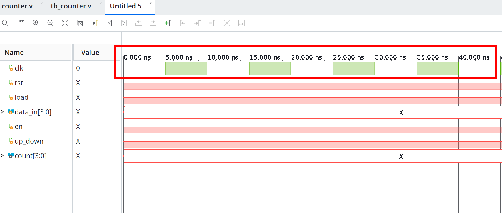
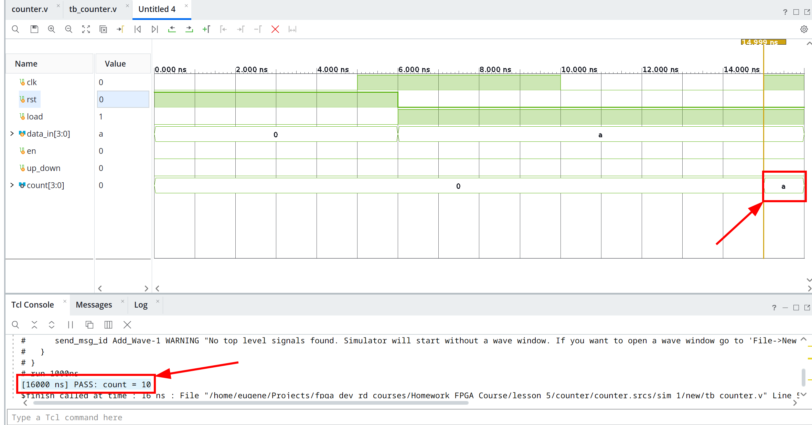
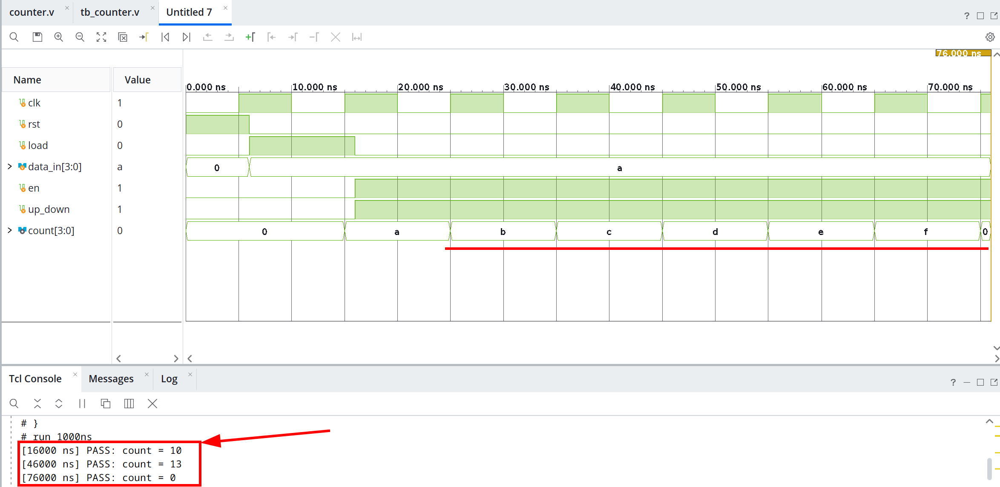
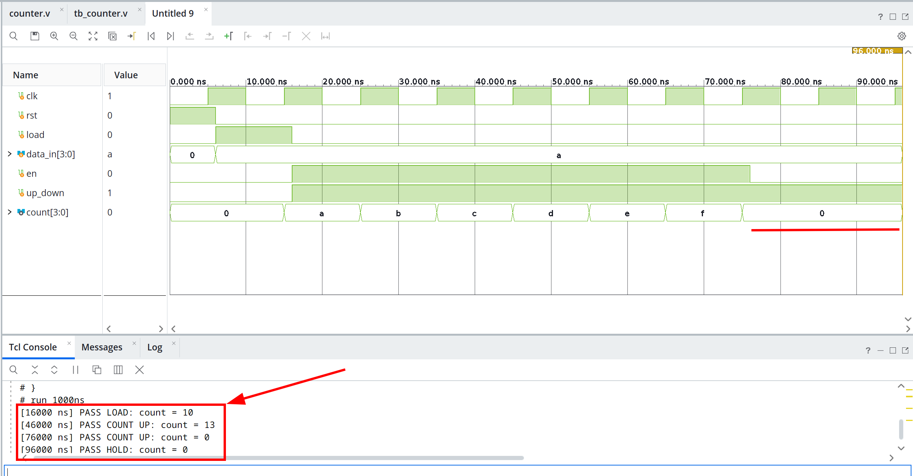
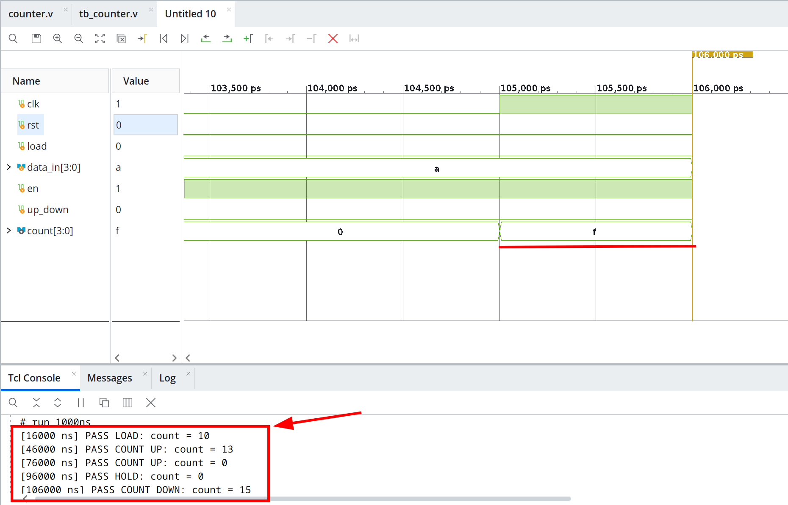
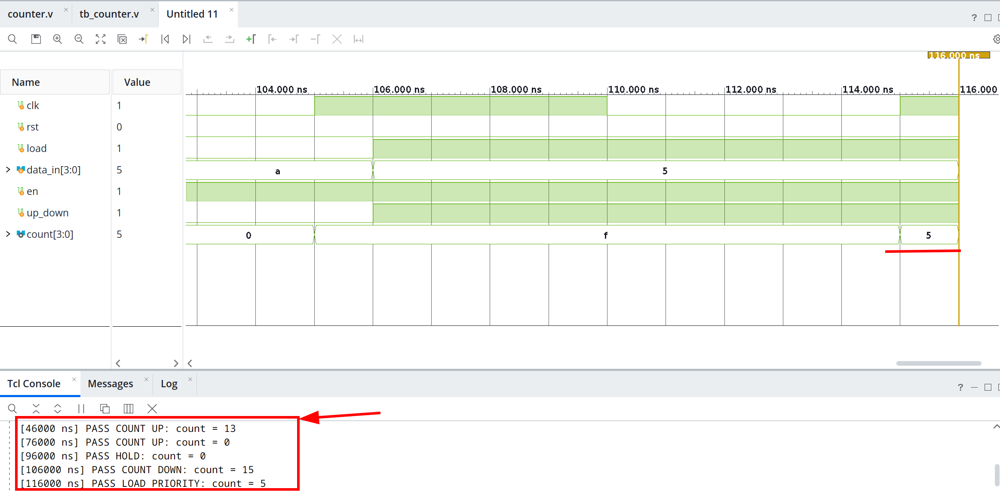
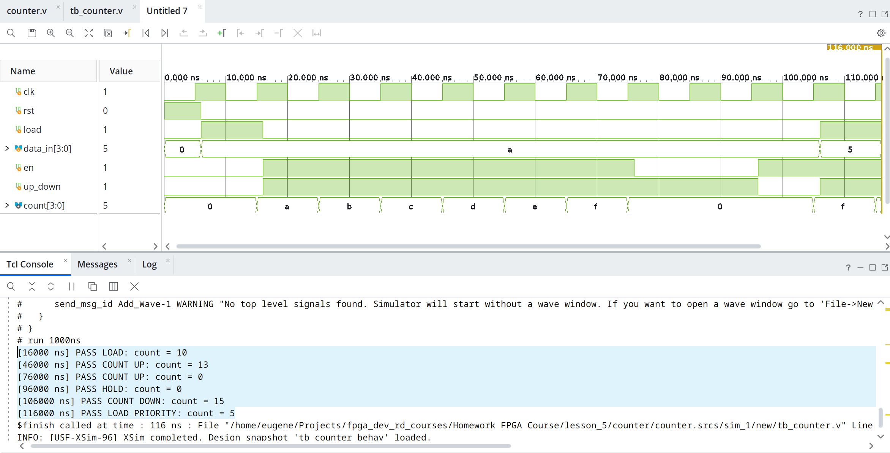
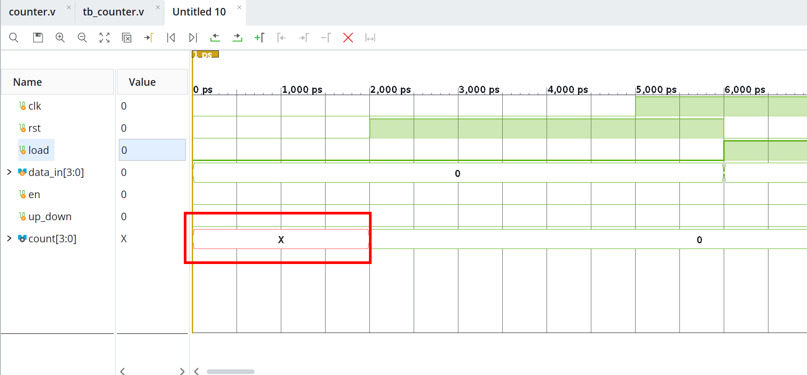
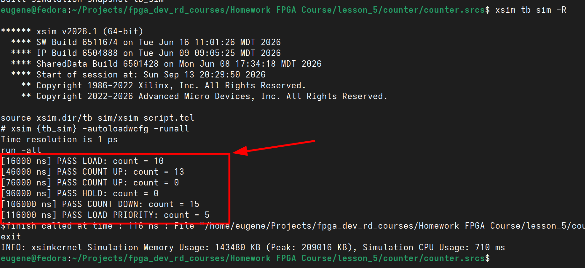
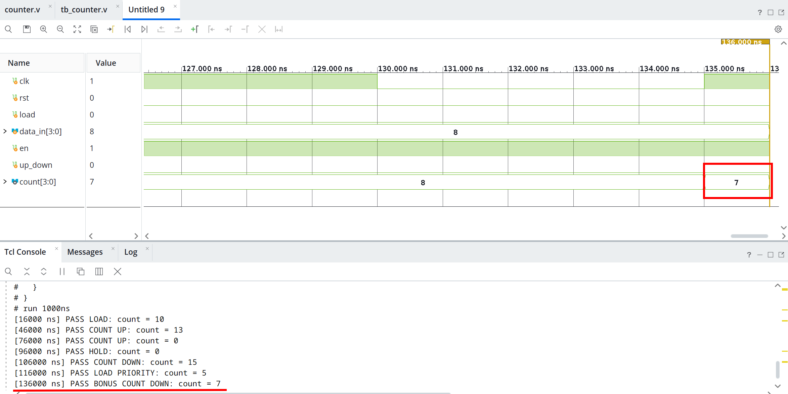

# Lesson 5 — Homework Report

## 1. Counter Module
Implement `counter.v` with the following behavior and priority:

1. `rst = 1` — asynchronously clear `count` to `0`.
2. Otherwise, if `load = 1` — load `data_in`.
3. Otherwise, if `en = 1` — count up or down depending on `up_down`.
4. Otherwise — keep the previous value.

The source files for this task are located [here](./counter/counter.srcs/sources_1/new).

### Implementation

```verilog
module counter(
    input   wire        clk,
    input   wire        rst,
    input   wire        load,
    input   wire [3:0]  data_in,
    input   wire        en,
    input   wire        up_down,
    output  reg  [3:0]  count
);

    always @(posedge clk or posedge rst) begin
        if (rst)
            count <= 4'b0000;
        else if (load)
            count <= data_in;
        else if (en) begin
            if (up_down)
                count <= count + 1'b1;
            else
                count <= count - 1'b1;
        end
    end

endmodule
```

This implementation directly follows the required priority: `rst > load > en > hold `.

## 2. Testbench Setup

Create `tb_counter.v`, declare all DUT inputs as `reg`, declare `count` as `wire`, instantiate the DUT, and generate a clock.

The source files for this task are located [here](./counter/counter.srcs/sim_1/new).

### Testbench Setup

```verilog
module tb_counter;
    reg         clk;
    reg         rst;
    reg         load;
    reg  [3:0]  data_in;
    reg         en;
    reg         up_down;
    wire [3:0]  count;

    initial clk = 0;
    always #5 clk = ~clk;

    counter dut (
        .clk(clk),
        .rst(rst),
        .load(load),
        .data_in(data_in),
        .en(en),
        .up_down(up_down),
        .count(count)
    );
endmodule
```

With `` `timescale 1ns / 1ps `` and `always #5 clk = ~clk`, the clock period is `10 ns`, which corresponds to `100 MHz`.

Screenshot of the initial simulation setup:



## 3. Load Verification

Reset the counter, load decimal `10`, and verify that the counter contains the loaded value.

### Added Test Sequence

```verilog
...
    initial begin 
        // INIT
        load = 1'b0;
        data_in = 4'b0;
        en = 1'b0;
        up_down = 1'b0;

        // RESET
        rst = 1'b1;
        @(posedge clk); 
        #1; 
        rst = 1'b0;

        // LOAD
        load = 1'b1; 
        data_in = 4'd10; 
        @(posedge clk); 
        #1;
        load = 1'b0;  
        if(count === 4'd10)
            $display("[%0t ns] PASS: count = %0d", $time, count);
        else 
            $display("[%0t ns] FAIL: count = %0d, expected 10", $time, count);
        $finish;
    end
...
```

Expected result: `count = 10`.

Screenshot:



## 4. Count-Up Verification and Overflow

Starting from `10`, count up three times and verify `13`. Then count three more times and verify the wrap-around: `13 -> 14 -> 15 -> 0`.

### Added Test Sequence

```verilog
...
    // COUNT UP
    en = 1'b1;
    up_down = 1'b1;

    @(posedge clk); #1;
    @(posedge clk); #1;
    @(posedge clk); #1;

    if(count === 4'd13)
        $display("[%0t ns] PASS: count = %0d", $time, count);
    else 
        $display("[%0t ns] FAIL: count = %0d, expected 13", $time, count);

    @(posedge clk); #1;
    @(posedge clk); #1;
    @(posedge clk); #1;

    if(count === 4'd0)
        $display("[%0t ns] PASS: count = %0d", $time, count);
    else 
        $display("[%0t ns] FAIL: count = %0d, expected 0", $time, count);
...
```

Expected sequence: `10 -> 11 -> 12 -> 13` and `13 -> 14 -> 15 -> 0`.

Screenshot:



## 5. Hold Verification (`en = 0`)

Disable counting and verify that the counter keeps its previous value for two clock cycles.

The previous value is `0`.

### Added Test Sequence

```verilog
...
    // COUNT HOLD
    en = 1'b0;

    @(posedge clk); #1;
    @(posedge clk); #1;

    if(count === 4'd0)
        $display("[%0t ns] PASS HOLD: count = %0d", $time, count);
    else 
        $display("[%0t ns] FAIL HOLD: count = %0d, expected 0", $time, count);
...
```

Expected result: `count = 0`.

The value must remain unchanged while `en = 0`.

Screenshot:




## 6. Count-Down Verification and Underflow

Enable down-counting from `0` and verify the natural 4-bit wrap-around `0 -> 15`.

### Added Test Sequence

```verilog
...
    // COUNT DOWN
    en = 1'b1;
    up_down = 1'b0;

    @(posedge clk);
    #1;

    if(count === 4'd15)
        $display("[%0t ns] PASS COUNT DOWN: count = %0d", $time, count);
    else 
        $display("[%0t ns] FAIL COUNT DOWN: count = %0d, expected 15", $time, count);
...    
```

Expected result: `count = 15`.

Screenshot:



## 7. Load Priority over Enable

Verify that `load` has higher priority than `en`.

Both signals are asserted at the same time:

```text
load    = 1
en      = 1
up_down = 1
data_in = 5
```

The counter must load `5` instead of performing a count operation.

### Added Test Sequence

```verilog
...
    // LOAD PRIORITY
    load = 1'b1;
    data_in = 4'd5;
    en = 1'b1;
    up_down = 1'b1;

    @(posedge clk);
    #1;

    if(count === 4'd5)
        $display("[%0t ns] PASS LOAD PRIORITY: count = %0d", $time, count);
    else 
        $display("[%0t ns] FAIL LOAD PRIORITY: count = %0d, expected 5", $time, count);
...
```

Expected result `count = 5`.


This confirms the required priority `load > en`.


Screenshot:



## 8. Reusable `check_count` Task

Replace repeated manual `if/else` checks with a reusable `task automatic`.

The task only performs comparison and reporting. Clock waiting remains in the main test sequence because different tests require different numbers of clock cycles.

### Added Task

```verilog
...
    task automatic check_count;
        input [3:0] expected;
        input [8*20-1:0] name;

        begin
            if (count === expected)
                $display(
                    "[%0t ns] PASS %0s: count = %0d",
                    $time, name, count
                );
            else
                $display(
                    "[%0t ns] FAIL %0s: count = %0d, expected %0d",
                    $time, name, count, expected
                );
        end
    endtask
...
```

provides enough storage for the longest test name used in this testbench.

Example calls:

```verilog
check_count(4'd10, "LOAD");
check_count(4'd13, "COUNT UP");
check_count(4'd0,  "HOLD");
check_count(4'd15, "COUNT DOWN");
check_count(4'd5,  "LOAD PRIORITY");
```

Screenshot:



## 9. Unknown (`X`) State in the Wave Window

Observe `count` before reset is applied.

To make the unknown state visible in the waveform, the testbench starts with reset inactive and waits briefly before asserting it:

```verilog
...
    rst = 1'b0;
    #2;

    rst = 1'b1;
...
```

Before reset, `count` is shown as `X`.

### Explanation

> `count` is `X` before reset because the register has not been initialized yet, so its initial value is unknown in simulation.

Screenshot:



## 10. Console-Mode Simulation

Run the complete simulation from the command line.

### Commands

```bash
xvlog counter.v tb_counter.v
xelab tb_counter -s tb_sim
xsim tb_sim -R
```

### Simulation Output

The simulation produced the expected PASS messages:

```text
[16000 ns] PASS LOAD: count = 10
[46000 ns] PASS COUNT UP: count = 13
[76000 ns] PASS COUNT UP: count = 0
[96000 ns] PASS HOLD: count = 0
[106000 ns] PASS COUNT DOWN: count = 15
[116000 ns] PASS LOAD PRIORITY: count = 5
```

This confirms that all required functional checks passed.

Screenshot:



## Bonus — Normal Count-Down Case

Verify a non-boundary down-counting case.

The counter is loaded with `8`, then counted down once.

Expected result: `8 -> 7`.

### Added Test Sequence

```verilog
...
    // BONUS COUNT DOWN
    load = 1'b1;
    data_in = 4'd8;
    en = 1'b1;
    up_down = 1'b0;

    @(posedge clk);
    #1;

    load = 1'b0;

    @(posedge clk);
    #1;

    check_count(4'd7, "BONUS COUNT DOWN");
...
```

Expected result: `count = 7`.

This confirms that ordinary down-counting works correctly in addition to the boundary case `0 -> 15`.

Screenshot:




